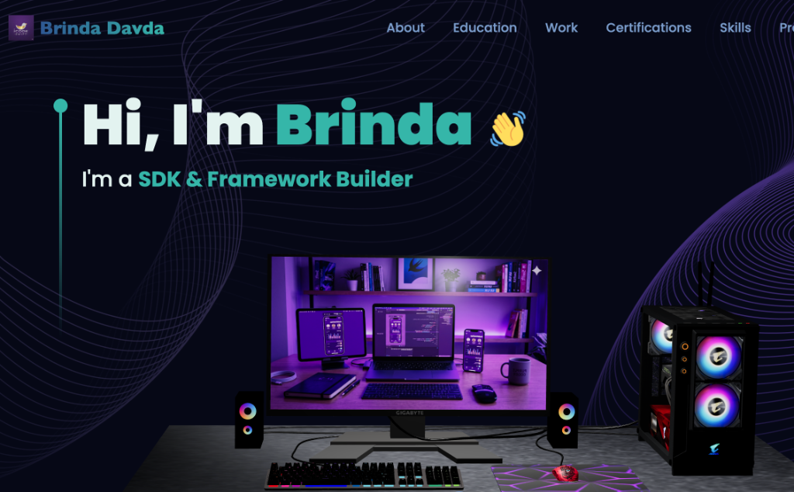
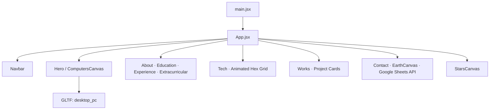

<div align="center">

# Brinda Davda — Premium 3D Portfolio

<p align="center">
	<a href="https://github.com/brindadavda/React-and-Three.js-portfolio-/stargazers"></a>
	<a href="https://github.com/brindadavda/React-and-Three.js-portfolio-/network/members"></a>
	<a href="#tech-stack"></a>
	<a href="https://react-and-three-js-portfolio.vercel.app/"></a>
</p>

<p align="center">
	<a href="https://github.com/brindadavda/React-and-Three.js-portfolio-/issues"></a>
	<a href="https://github.com/brindadavda/React-and-Three.js-portfolio-/pulls"></a>
	
	
	
</p>

</div>

<p align="center">
	<picture>
		
	</picture>
</p>

An immersive, performant 3D portfolio powered by React, react-three-fiber (Three.js), Framer Motion, and Tailwind CSS — featuring custom 3D parallax effects, volumetric card tilts, magnetic proximity buttons, and a serverless Google Sheets integration.

<p align="center"><strong><a href="https://react-and-three-js-portfolio.vercel.app/">Live Demo → react-and-three-js-portfolio.vercel.app</a></strong></p>

<details>
	<summary><b>Table of Contents</b></summary>

- Overview
- Key 3D Features
- Tech Stack
- Architecture
- Quick Start
- Environment Variables
- Scripts
- Project Structure
- Deployment & Serverless
- SEO
- Attributions
- Roadmap
- Contributing
- Security
- FAQ
- Maintainer
- Contact

</details>

---

## Overview


This project is a high-fidelity single-page portfolio application scaffolded with Vite and styled with Tailwind CSS, using react-three-fiber and drei to render dynamic 3D scenes. The site is optimized for ultra-smooth responsiveness, custom cursor-following parallax depth, and features a serverless pipeline to track contact form messages in real-time.

It is pre-configured for instant deployment on **Vercel** with custom redirects and API endpoints.

---

## Key 3D Features

- **3D Hero Scene**: Interactive desktop PC GLTF model with OrbitControls, mobile-friendly camera scaling, and custom positioning.
- **Cursor-Responsive Parallax Starfield**: WebGL starfield with `3000` particle points that tilt and rotate dynamically in response to real-time mouse coordinate shifting.
- **Universal 3D Card Tilts**: Volumetric cards in the Services, Experience, Extracurriculars, and Testimonials sections use `react-tilt` with spring physics to follow the user's cursor.
- **Magnetic Proximity CTA Buttons**: Reusable `<Magnetic>` wrapper component that dynamically pulls button objects towards the cursor when hovered.
- **Serverless Message Logging**: Unified POST endpoint that bypasses EmailJS in favor of writing directly to Google Sheets with simple CORS parameters, featuring automatic local console fallbacks.
- **Premium Color Palette**: Styled in a custom coastal theme including deepest midnight navy (`#0d113b`), slate royal navy (`#1d2d75`), and vibrant turquoise teal (`#35b5a9`) highlights.

---

## Tech Stack

- **Runtime**: React 18, React Router 6
- **3D/Graphics**: `@react-three/fiber`, `@react-three/drei`, `three`, `maath`
- **Styling**: Tailwind CSS
- **Motion**: Framer Motion
- **Tooling**: Vite, ESLint
- **PDF Manipulation**: `pdf-lib` (for setting metadata titles on served resumes)

---

## Architecture



---

## Quick Start

### Prerequisites
- Node.js 18+ (tested with Node 20.x/22.x)

### Install and run

```bash
npm install
npm run dev
```

### Build and preview

```bash
npm run build
npm run preview
```

---

## Environment Variables

Create a `.env` or `.env.local` in the project root to link the spreadsheet tracker:

```dotenv
# API URL of your Google Web App script deployment
VITE_SHEET_API_URL=https://script.google.com/macros/s/your_deployment_id/exec
```

*Note: If `VITE_SHEET_API_URL` is not provided, the contact form will automatically fall back to **Local Mock Mode**, logging form entries nicely inside the browser console for safe testing.*

---

## Scripts

| Script | Action |
|---|---|
| `npm run dev` | Start Vite local dev server |
| `npm run build` | Build optimized production assets to `dist/` |
| `npm run preview` | Preview the built site locally |
| `npm run lint` | Lint `src/` files with ESLint |

---

## Project Structure

```
react-threejs-portfolio/
├─ vercel.json                  # Production Vercel rewrites config
├─ vite.config.js               # Dev servers, proxies, and resume plugins
├─ package.json                 # Scripts and dependencies
├─ api/
│  └─ resume.js                 # Vercel serverless function (resume delivery)
├─ public/
│  ├─ desktop_pc/              # GLTF computer assets + CC-BY license
│  ├─ planet/                  # GLTF earth assets + CC-BY license
│  └─ resume/                  # Your PDF resumes for clean streaming
├─ src/
│  ├─ App.jsx                  # Route shell and section composition
│  ├─ components/              # UI sections and canvases
│  │  ├─ canvas/               # R3F scenes: Computers, Earth, Stars, Magnetic
│  │  └─ *.jsx
│  ├─ constants/               # Configured data for nav, projects, and skills
│  ├─ utils/motion.js          # Framer Motion entrance spring variables
│  ├─ assets/                  # Images, logos, and textures
│  ├─ styles.js                # Tailwind class layout tokens
│  └─ main.jsx                 # App bootstrap + SpeedInsights
└─ tailwind.config.js          # Color palettes and core variables
```

---

## Deployment & Serverless

### Vercel Serverless Function (/api/resume)
This repository is configured to serve your resume dynamically and cleanly at `/resume` without showing raw file extensions. 
- In development, `vite.config.js` sets up a middleware proxy.
- In production, `vercel.json` rewrites requests to `api/resume.js`, which dynamically streams the most recent PDF from `public/resume` and updates the viewer's tab title to the file's basename using `pdf-lib`.

---

## SEO

- `sitemap.xml` in root for crawlers.
- Open Graph metadata in `index.html` including previews and rich description tags.
- High-contrast typography designed for perfect accessibility rankings.

---

## Attributions

### 3D Models (CC-BY-4.0)
- Gaming Desktop PC by Yolala1232 — https://sketchfab.com/3d-models/gaming-desktop-pc-d1d8282c9916438091f11aeb28787b66
- Stylized planet by cmzw — https://sketchfab.com/3d-models/stylized-planet-789725db86f547fc9163b00f302c3e70

### Core Libraries
- React, Three.js, react-three-fiber, drei, Tailwind CSS, Framer Motion, Vite, maath.

---

## Maintainer

<table>
	<tr>
		<td width="80">
			
		</td>
		<td>
			<b>Brinda Davda</b><br/>
			<a href="https://react-and-three-js-portfolio.vercel.app/">Website</a> • <a href="mailto:appstudio.devteam@gmail.com">Email</a>
		</td>
	</tr>
	<tr>
		<td colspan="2">
			⭐ If you like this project, consider starring it on GitHub!
		</td>
	</tr>
</table>

---

## Contact

- **Portfolio**: https://react-and-three-js-portfolio.vercel.app/
- **Email**: appstudio.devteam@gmail.com
- **Phone**: +91 78598 55287
